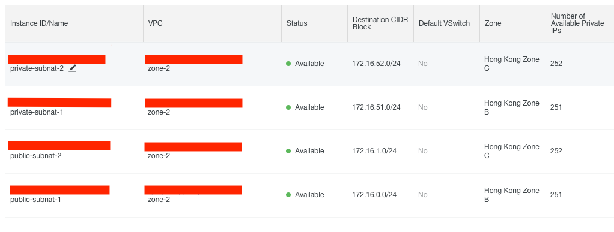
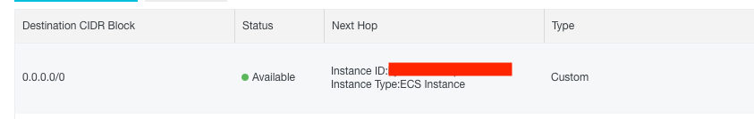

# How to Setup a NAT Gateway and OpenVPN server on Cloud.

After few days of wondering around the web, I manage to setup a VPC network on the Cloud (AliCloud), with a dedicated ECS instance as the NAT gateway and OpenVPN server. Even many of the Cloud vendors (AWS, AliCloud, Azure, etc) nowadays provide NAT Gateway as a service, it is still more cost friendly to setup your own NAT gateway instance, especially when you combine both the NAT gateway service together with the OpenVPN server. I put up this document to help people who wants to setup their own NAT gateway instance without using NAT Gateway as a service.

In this document we used the following services:

<ul>
  <li>AliCloud ECS service - 1 x ecs.t5-lc1m1.small instance </li>
  <li>AliCloud Elastic IP service </li>
  <li>AliCloud VPC</li>
</ul>
  
We will go through both the NAT Gateway setup flow as well as the OpenVPN setup flow. The following diagram gives a high level picture of the NAT gateway setup. 

<h2>Setup a NAT gateway using AliCloud ECS instance</h2>

A NAT gateway routes traffic in/out to/from private network to the public network, and eventually connecting the private network with public network. To create a NAT gateway, first we need to create a VPC network on the cloud. 

<ul>
  <li>In AliCloud, go to ECS -> Virtual Private Cloud, choose "Create VPC" and assign an name for the VPC network.</li>
  <li>Assign a CIDR block "172.16.0.0/12" </li>
  <li>Create a VSwitch with Zone "Hong Kong Zone B" - CIDR block "172.16.0.0/24" </li>
</ul> 

Create a pair of subnets for each available zone, a private subnet and a public subnet.

Navigate to the public subnet, and create a new ECS instance. In my case, I choose a small instance to save money ^^. Assign an elastic IP to the newly created instance (nat-instance).  

<h3>Configure the NAT instance</h3>
SSH onto the nat-instance, edit /etc/sysctl.conf file and add the following lines to the configuration.
<blockquote>
    net.ipv4.ip_forward = 1
    net.ipv4.conf.eth0.send_redirects = 0
</blockquote>

Run "sysctl -p /etc/sysctl.conf" to load the configuration change.

Make sure that iptables is installed on the box, if not run "yum install iptables". Edit the configuration file in /etc/iptables.conf.

<blockquote>
*nat
:PREROUTING ACCEPT [2:120]
:INPUT ACCEPT [0:0]
:OUTPUT ACCEPT [0:0]
:POSTROUTING ACCEPT [0:0]
-A POSTROUTING -s 172.16.51.0/24 -j SNAT --to-source 172.16.0.9
-A POSTROUTING -o eth0 -j MASQUERADE
COMMIT
*filter
:INPUT ACCEPT [2097:1031304]
:FORWARD ACCEPT [8584:1438414]
:OUTPUT ACCEPT [1434:180416]
COMMIT  
</blockquote>

make sure to forward all traffic in the private subnet to the nat-instance using private ip. In this case, 172.16.0.9 is the private IP of the nat-instance, and 172.16.51.0/24 is the IP range of the private subnet.

Run "iptables-restore < /etc/iptables.conf" to reload the rules, and use "iptables -L" to verify the rules are loaded.

<h3>Route traffic to the NAT Instance</h3>
Go to Route entry settings on AliCloud and add "0.0.0.0/0" point to NAT-instance.   

HOORAY!!! now we have a NAT gateway that routes traffic to our internal networks!!! Let's verify the connection. 

<h2>Setup a VPN server on ECS</h2>

To make our NAT instance more feature rich, we going to add a VPN server on to the instance. Before we begin, make sure the following components are installed (OpenVPN, Easy-RSA, iptables-services). Run the following command "yum -y install openvpn iptables-services" to install those components.   

<h3>Install OpenVPN</h3>

<h3>Install EasyRSA</h3>

<h3>Generate Keys</h3>

<h3>Configure VPN</h3>

<h3>Configure Client</h3>

