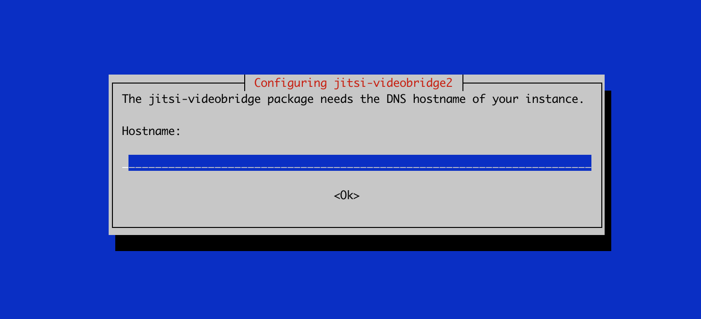

# How to load balance Jitsi Meet with multiple Videobridge

## Introduction
In this document, we going to link the Jitsi meet installed in [previous article](./README.md) with multiple Videobridges.
Videobridge communicates using XMPP protocol, so we can setup a XMPP Pubsub node that listens to all Videobridge nodes, and pushes the events to Jicofo.


## Prerequisits
In this article, we assume you have two server machines, one (Server A) with default Jitsi Meet installation, and the other (Server B) is empty.

- Debian machine with [Default Jitsi Meet installation](README.md) (Server A)
- Debian machine OS 9 (Skretch) or later  (Server B)

## PART A. Configuration Change to Server A 
First, ssh onto Server A machine, again here we assume that you have Jitsi meet installed on Server A. You can refer to [this guide for default Jitsi Meet installation](README.md).

### Step 1. Add the JIDs of the Videobridges as Admins
Edit the Prosody configuration in `/etc/prosody/conf.d/<dnsname>.cfg.lua`, add the following line under `authentication = ...`

```sh
  admins = {
    "jitsi-videobridge.<dnsname>",
    "videobridge2.<dnsname>",
  }
```
So your configuration file should look like below.
```sh
VirtualHost "<dnsname>"
  -- enabled = false -- Remove this line to enable this host
  authentication = "internal_plain" //Note this value can be "anonymous", if you haven't enabled authentication
  admins = {
    "jitsi-videobridge.<dnsname>",
    "videobridge2.<dnsname>",
  }
  ...
```

### Step 2. Configure Videobridge configuration
Now, edit the videobridge configuration in `/etc/jitsi/videobridge/config`, and look for the configuration line `JVB_OPTS="--apis=,"`, and change it to following. By default, the videobridge uses `jitsi-videobridge` as the default subdomain, so we can use this subdomain for the first videobridge node.
```sh
JVB_OPTS="--apis=rest,xmpp --subdomain=jitsi-videobridge"
JVB_HOST=<domainname> 
```

### Step 3. Change Prosody to listen to public interface
Edit the prosody configuration `/etc/prosody/prosody.cfg.lua` to listen for public IP, add the following configuration under `admin = { }`
```sh
component_ports = {5347}
component_interface = "<IPaddress>"  //replace this IP address with the public IP of your main Jitsi Meet server (Server A)
```
Note the IP address here is dependant on your network setup. If you have issue with connecting to the prosody from videobridge, try change this IP to `0.0.0.0`, which listens for all IP ranges.

### Step 4. Change Jicofo configuration to use public domain
Now, change the following configuration files to replace `localhost` with your jitsi domain.
First, `/etc/jitsi/jicofo/config`
```sh
JICOFO_HOST=<domainname>  //domain name is the domain name of your jitsi server (Server A)
```

### Step 5. Change Videobridge to use pubsub
In `/etc/jitsi/videobridge/sip-communicator.properties` to enable statistics and to set statistics to use pubsub, add the following lines if they are missing, or otherwise make sure the transport is pubsub
```sh
org.jitsi.videobridge.ENABLE_STATISTICS=true
org.jitsi.videobridge.STATISTICS_TRANSPORT=pubsub
org.jitsi.videobridge.PUBSUB_SERVICE=<domainname>
org.jitsi.videobridge.PUBSUB_NODE=sharedStatsNode
```

### Step 6. Change Jicofo to use pubsub
In `/etc/jitsi/jicofo/sip-communicator.properties` file, adding the following lines
```sh
org.jitsi.focus.pubsub.ADDRESS=<domainname>
org.jitsi.focus.STATS_PUBSUB_NODE=sharedStatsNode
```

Please note that the domain name `<domainname>` or `<dnsname>` is the domain of the main Jitsi server (Server A).

### Step 7. Open Ports on the main server (Server A)
Make sure the following ports are  open:
-  TCP/UDP Port 5347
-  TCP/UDP Port 5222

## PART B. Changes on the second videobridge server (Server B)
Now, let's install the second Videobridge on the the second server node. First, SSH on to the second server

### Step 1. Add the Jitsi package library
Run following command as super user.
```sh
$ echo 'deb https://download.jitsi.org stable/' | sudo tee /etc/apt/sources.list.d/jitsi-stable.list
$ wget -qO -  https://download.jitsi.org/jitsi-key.gpg.key | sudo apt-key add -
```
If you hit an error like gnupg, gnupg2 and gnupg1 do not seem to be installed, you will need to install gnupg or gnupg2 using apt-get install gnupg2. Then you can add the key after that.

### Step 2. Install jitsi videobridge 
run the following command
```sh
$ apt-get update
$ apt-get install jitsi-videobridge
```

During the installation, we will get prompted for Domain name of the main server, replace localhost with the domain name of the main server.

### Step 3. Configure Videobridge to use pubsub
in `/etc/jitsi/videobridge/sip-communicator.properties` to enable statistics and to set statistics to use pubsub, add the following lines if they are missing, or otherwise make sure the transport is pubsub, make sure the `domainname` is pointing to server A.
```sh
org.jitsi.videobridge.ENABLE_STATISTICS=true
org.jitsi.videobridge.STATISTICS_TRANSPORT=pubsub
org.jitsi.videobridge.PUBSUB_SERVICE=<domainname>
org.jitsi.videobridge.PUBSUB_NODE=sharedStatsNode
```

### Step 4. Configure Videobridge to connect to the main server
Now, edit the videobridge configuration in `/etc/jitsi/videobridge/config`, and look for the configuration line `JVB_OPTS="--apis=,"`, and change it to following. By default, the JID uses `jitsi-videobridge` as the default subdomain, so this change will set JID to use custom domain `videobridge2`.
```sh
JVB_OPTS="--apis=rest,xmpp --subdomain=videobridge2" 
JVB_HOST=<domainname> 
```

## PART C. Add new videobridge components to main Jitsi server (Server A)

### Step 1. Set videobridge credentials
Edit the file in `/etc/prosody/conf.d/<dnsname>.cfg.lua`, at the bottom of the main `VirtualHost` add the following
```sh
Component "videobridge2.<dnsname>" //This is the domain name of the second videobridge
   component_secret = "<password>" //This can be found on second VB, under /etc/jitsi/videobridge/config
```

Check the component list, make sure the `componet_secret` of `Component "jitsi-videobridge..."` is set, and is the same as the value in `/etc/jitsi/videobridge/config` on server A. Note in some Jitsi Meet version, this setting can be missing, so make sure you add this component if it's missing.
```sh
Component "videobridge2.<dnsname>" //This is the domain name of the default videobridge
   component_secret = "<password>" //This can be found on first VB, under /etc/jitsi/videobridge/config
```

### Step 2. Restart the services on Server A
```sh
$ sudo service prosody reload
$ sudo service jicofo restart
$ sudo service jitsi-videobridge restart
$ sudo service nginx restart
```

### Step 3. Restart videobridge on Server B
```sh
$ sudo service jitsi-videobridge restart
```
